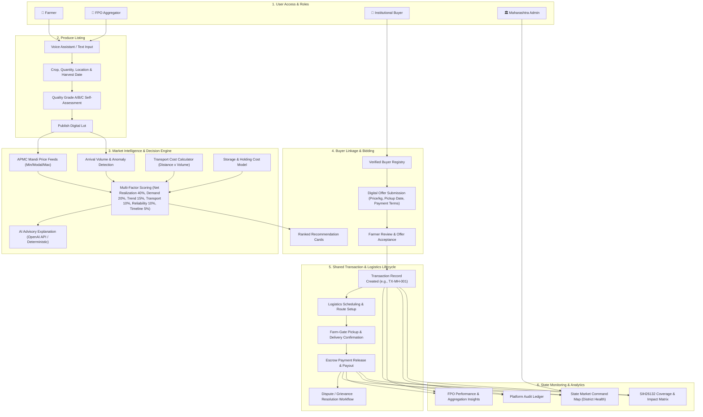

# 🌾 AgriLink Maharashtra

> **Smart India Hackathon 2026 Prototype** | **Problem Statement ID: 26132**

An intelligent agricultural market-linkage and price-discovery platform designed to empower smallholder farmers and Farmer Producer Organisations (FPOs) in Maharashtra. AgriLink combines real-time APMC mandi prices, institutional buyer demand, quality specifications, arrival volumes, logistics costs, storage availability, and buyer reliability to compute **true expected net realization** and recommend optimal selling decisions.

---

## 1. Project Overview

Smallholder farmers frequently suffer from asymmetric market information, selling produce at sub-optimal prices in immediate local mandis without visibility into transport costs, storage risk, or verified institutional demand.

AgriLink transforms agricultural selling from guesswork into a data-driven decision process by answering four core questions for every harvest lot:

* **WHERE should I sell?** — Evaluates local mandis vs. regional processors, exporters, and institutional buyers based on distance-adjusted net realization.
* **WHEN should I sell?** — Recommends optimal 24–48 hour sale windows based on arrival volume surges, demand signals, and holding storage costs.
* **TO WHOM should I sell?** — Ranks verified buyers using a multi-factor score incorporating price, transport efficiency, and historical payment reliability.
* **WHY is this the recommended option?** — Provides deterministic scoring breakdowns and AI-assisted natural language explanations in local languages.

### Stakeholders Supported
* **Farmers**: Create crop lots (via text or voice assistant), receive net realization recommendations, compare buyer quotes, accept offers, and track delivery and escrow payouts.
* **Farmer Producer Organisations (FPOs)**: Pool smallholder produce (e.g., 6,500 kg aggregated tomato lots) to unlock bulk buyer quotes, negotiation premiums (+₹1.20/kg), and shared transport savings.
* **Institutional Buyers & Processors**: Post commercial requirements, browse verified farmer/FPO lots, aggregate multi-farmer volume, submit digital offers with custom payment terms, and manage procurement.
* **Government of Maharashtra & Admin**: Monitor state market health across district hubs, track price anomalies, audit transparent digital transactions, resolve farmer grievances, and analyze platform impact metrics.

---

## 2. SIH Problem Statement

| Field | Details |
| :--- | :--- |
| **Problem Statement ID** | **26132** |
| **Title** | **Strengthening Market Linkages and Price Discovery for Farmers** |
| **Organization** | **Government of Maharashtra** (Department of Skills, Employment, Entrepreneurship and Innovation & Maharashtra State Innovation Society) |
| **Theme** | **Agriculture, FoodTech & Rural Development** |

### Problem Breakdown
Traditional agricultural marketing suffers from critical informational and operational fragmentation:
1. **Gross Price Misleading**: Mandi board tickers display gross modal prices without factoring in transport freight, unloading charges, commission fees, or storage degradation. High gross prices often result in lower net earnings.
2. **Uncoordinated Supply**: Farmers harvest and rush produce to nearby mandis simultaneously, causing localized supply gluts, price crashes, and high post-harvest losses (up to 14-18%).
3. **Lack of Buyer Verification**: Direct buyer sales carry payment delay risks and lack recourse when disputes arise.
4. **Volume Disadvantage**: Individual smallholders selling 1,000–2,000 kg lack bargaining power against bulk commercial procurement agents.

### How AgriLink Addresses These Gaps
AgriLink introduces a unified decision-support and transaction enablement ecosystem tailored for Maharashtra:
* Computes **Expected Net Realization** ($Gross - Transport - Storage - Transaction$) instead of displaying static market rates.
* Features **AI Sale Window Advisory** to guide farmers on whether to sell immediately or hold produce.
* Enables **Smallholder FPO Aggregation** to pool farm-gate volume into commercial buyer fulfillment contracts.
* Provides **Role-Gated Dashboards** with full transaction lifecycle tracking and digital grievance logging for state governance.

---

## 3. Solution Architecture & Decision Logic

### High-Level Transaction Flow

```
Farmer / FPO
    ↓
Crop & Lot Creation (Voice / Text)
    ↓
Market Intelligence (APMC Rates & Demand)
    ↓
AI / Decision Engine (Net Realization Algorithm)
    ↓
Verified Buyer Matching & Ranking
    ↓
Digital Offers (Price, Pickup Date, Terms)
    ↓
Offer Acceptance (Farmer Action)
    ↓
Transaction Creation (Shared Ledger State)
    ↓
Logistics Coordination & Milestone Tracking
    ↓
Escrow Settlement & Payment Payout
    ↓
Government Command Center Monitoring & Governance
```

### Core Value Proposition Formula

Standard price display systems only present **Gross Market Rates**. AgriLink computes **Expected Net Realization**:

$$\text{Expected Net Realization} = \text{Gross Value} - \text{Transport Freight} - \text{Storage Risk} - \text{Transaction Costs}$$

$$\text{Decision Matrix} = \text{Market Data} + \text{Buyer Demand} + \text{Logistics} + \text{Storage} + \text{Buyer Reliability} \implies \text{WHERE + WHEN + TO WHOM}$$

---

## 4. End-to-End System Flowchart



---

## 5. Key System Features & Portal Modules

### 🌾 Farmer Portal (`/farmer/*`)
* **Dashboard (`/farmer`)**: Farm-gate overview, active lots, incoming buyer offers, and market rate tickers.
* **Sell My Crop (`/farmer/create-lot`)**: Structured lot entry with Voice Input Assistant (`Web Speech API`), harvest date, selling deadline, and quality grading guide.
* **Check Market Prices (`/farmer/market`)**: Real-time modal prices and 5-day price trends across Maharashtra APMCs (Nashik, Pune, Nagpur, Solapur, Sangli).
* **Find Buyers (`/farmer/recommendations`)**: AI decision engine output displaying ranked buyer options, expected net realization breakdowns, "What-If I Wait?" storage simulator, and AI natural language advisory.
* **My Offers (`/farmer/offers`)**: Incoming buyer bids with instant Accept/Reject action buttons. Accepting an offer automatically instantiates a shared transaction record.
* **Track My Sale (`/farmer/track`)**: Visual delivery timeline (`Offer Accepted` $\rightarrow$ `Logistics Scheduled` $\rightarrow$ `Pickup Confirmed` $\rightarrow$ `Delivered` $\rightarrow$ `Payment Released`).
* **FPO Aggregation (`/farmer/fpo`)**: FPO member pooling view showing smallholder contributions (e.g., 6,500 kg total produce) and institutional buyer contract matching.
* **Farmer SIH Coverage (`/farmer/coverage`)**: Requirement matrix mapping farmer workflows to SIH26132 problem statement items.

### 🏢 Buyer Portal (`/buyer/*`)
* **Dashboard (`/buyer`)**: Overview of open produce lots, active regions in Maharashtra, procurement statistics, and order state.
* **Available Agricultural Lots (`/buyer/lots`)**: Filterable marketplace grid of verified farmer and FPO produce listings.
* **Make Offer (`/buyer/lots/[id]`)**: Submit digital quotes with price per kg, pickup date, and payment terms (e.g., payment within 2 days of delivery).
* **AI Lot Aggregation (`/buyer/aggregate`)**: Combines multiple smallholder farm lots to fulfill commercial bulk procurement requirements (e.g., 6,000 kg Grade A tomato).
* **My Procurement & Orders (`/buyer/procurement`)**: Order management table for tracking accepted bids and delivery schedules.
* **Transactions (`/buyer/transactions`)**: Buyer-specific transaction ledger showing purchase rates, freight costs, and escrow payment clearance.
* **Buyer SIH Coverage (`/buyer/coverage`)**: Requirement matrix mapping buyer workflows to SIH26132 specifications.

### 🏛️ Government / Admin Command Center (`/admin/*`)
* **Market Command Center (`/admin`)**: Interactive district market health map of Maharashtra, total farmers, active lots, verified buyers, and arrival surge anomaly alerts.
* **Market Intelligence (`/admin/markets`)**: Benchmark modal prices, min/max spreads, and arrival volume monitoring across pilot districts.
* **Buyer Registry (`/admin/buyers`)**: Platform Verified Buyer Directory featuring business credentials (GST/FSSAI), reliability scores, and historical payment performance.
* **State FPO Insights (`/admin/fpo`)**: Performance dashboard for tracking smallholder aggregation and commercial contract fulfillment.
* **State Audit Ledger (`/admin/transactions`)**: Complete digital transaction ledger with lifecycle step progression (`OFFER_ACCEPTED` $\rightarrow$ `PAID`).
* **Grievance Center (`/admin/grievances`)**: Dispute tracking module for payment delay complaints with AI classification and resolution status.
* **Impact Dashboard (`/admin/impact`)**: Demonstration metrics dashboard displaying estimated price realization improvements (+12.6%), post-harvest loss reduction (14.2%), and logistics savings (−18.4%).
* **Government SIH Coverage (`/admin/coverage`)**: State governance compliance checklist for Problem Statement 26132.

---

## 6. SIH 2026 Problem Statement 26132 Coverage Matrix

Summary: **18 / 18 Core Requirements Covered** (13 Implemented • 5 Prototype/Demo • 0 Unaddressed)

| Requirement ID | Requirement Description | Implementation Status | System Feature / Route |
| :--- | :--- | :--- | :--- |
| **REQ-01** | Mandi & Market Price Intelligence | 🟢 Implemented | APMC Market Intelligence (`/farmer/market`, `/admin/markets`) |
| **REQ-02** | Buyer Demand & Volume Aggregation | 🟢 Implemented | AI Lot Aggregation Engine (`/buyer/aggregate`) |
| **REQ-03** | Quality Specifications & Grading | 🟡 Prototype | Quality Self-Assessment & Filtering (`/farmer/create-lot`) |
| **REQ-04** | Arrival Volumes & Supply Alerts | 🟢 Implemented | Arrival Anomaly & Market Health (`/admin`) |
| **REQ-05** | Transport Cost Calculator | 🟢 Implemented | Distance-Based Freight Engine (`/farmer/recommendations`) |
| **REQ-06** | Storage & Holding Cost Model | 🟢 Implemented | Holding Risk & Daily Storage Model (`/farmer/recommendations`) |
| **REQ-07** | Net Realization Decision Engine | 🟢 Implemented | Multi-Factor Scoring Engine (`src/lib/decision-engine.ts`) |
| **REQ-08** | Sale-Window Recommendation | 🟢 Implemented | AI Sale Window Component (`/farmer/recommendations`) |
| **REQ-09** | Farmer $\rightarrow$ Verified Buyer Linkage | 🟢 Implemented | Buyer Recommendation & Registry (`/farmer/recommendations`, `/admin/buyers`) |
| **REQ-10** | Digital Lot Creation & Management | 🟢 Implemented | Farmer Lot Creation & Voice Assistant (`/farmer/create-lot`) |
| **REQ-11** | Digital Offer & Bidding System | 🟢 Implemented | Direct Buyer Bidding & Offer Management (`/buyer/lots/[id]`, `/farmer/offers`) |
| **REQ-12** | Logistics & Transport Coordination | 🟡 Prototype | Delivery & Pickup Tracking (`/farmer/track`, `/buyer/procurement`) |
| **REQ-13** | Transparent Digital Transactions | 🟢 Implemented | Shared Transaction Ledger (`/admin/transactions`, `/buyer/transactions`) |
| **REQ-14** | Dispute & Grievance Resolution | 🟢 Implemented | Farmer Grievance Resolution Center (`/admin/grievances`) |
| **REQ-15** | FPO Aggregation & Pooling | 🟢 Implemented | Smallholder FPO Pooling Dashboard (`/farmer/fpo`, `/admin/fpo`) |
| **REQ-16** | Ecosystem Impact Monitoring | 🟡 Prototype | State Impact Analytics (`/admin/impact`) |
| **REQ-17** | Multilingual Accessibility | 🟢 Implemented | Native EN / Marathi / Hindi Translation (`src/lib/translations.ts`) |
| **REQ-18** | Strict Role-Based Portal Isolation | 🟢 Implemented | Role-Guarded AppShell Navigation (`src/components/layout/app-shell.tsx`) |

---

## 7. Technology Stack

### Frontend & Application Framework
* **Framework**: Next.js 16.3.3 (React 19, App Router with Turbopack)
* **Language**: TypeScript 5
* **Styling**: TailwindCSS v4, Class Variance Authority (`class-variance-authority`), `clsx`, `tailwind-merge`
* **Icons**: Lucide React (`lucide-react`)
* **Charts & Visualizations**: Recharts v3.10.1 (`LineChart`, `BarChart`, `PieChart`)
* **Mapping**: Leaflet 1.9.4 & React Leaflet v5.0.0

### Decision Support & Intelligence Layer
* **Deterministic Decision Engine**: Multi-factor scoring algorithm (`src/lib/decision-engine.ts`) computing expected net realization based on distance, quantity, price trends, quality match, storage degradation, and buyer reliability.
* **AI Explanation API**: Next.js Route Handler (`src/app/api/explain/route.ts`) supporting OpenAI API integration (`gpt-4o-mini`) with fallback deterministic synthesis.
* **Voice Recognition**: Web Speech API (`webkitSpeechRecognition` / `SpeechRecognition`) for smallholder farmer lot entry.

### Data Management & State Flow
* **Data Provenance**: Shared single source of truth (`src/lib/store.ts`) with `globalThis` state persistence across Hot Module Replacement (HMR).
* **Server Actions**: Next.js Server Actions (`src/actions/agri-actions.ts`) managing lot creation, offer submission, transaction state transitions, and grievance creation.
* **Backend Database Integrations**: Supabase client packages (`@supabase/supabase-js`, `@supabase/ssr`) prepared for cloud database synchronization.
* **Validation & Formatting**: Zod v4.4.3 schema validation & `date-fns` v4.4.0 date handling.

---

## 8. Local Setup & Execution Guide

### Prerequisites
* **Node.js**: v18.0.0 or higher
* **npm**: v9.0.0 or higher

### Installation

1. **Clone the Repository**:
   ```bash
   git clone https://github.com/jeevankumarp-sizz/sihagr.git
   cd sihagr
   ```

2. **Install Dependencies**:
   ```bash
   npm install
   ```

3. **Configure Environment Variables** *(Optional)*:
   Create a `.env.local` file in the root directory if you wish to enable live OpenAI explanations or Supabase synchronization:
   ```env
   OPENAI_API_KEY=your_openai_api_key
   OPENAI_BASE_URL=https://api.openai.com/v1
   AI_MODEL=gpt-4o-mini

   NEXT_PUBLIC_SUPABASE_URL=your_supabase_project_url
   NEXT_PUBLIC_SUPABASE_ANON_KEY=your_supabase_anon_key
   ```
   *Note: If no API keys are provided, AgriLink automatically uses its built-in deterministic decision engine and fallback explanation generator without throwing errors.*

4. **Run the Development Server**:
   ```bash
   npm run dev
   ```
   Open [http://localhost:3000](http://localhost:3000) in your browser to view the landing page.

5. **Build for Production**:
   ```bash
   npm run build
   npm run start
   ```

---

## 9. Demonstrating AgriLink for SIH Evaluation

To demonstrate the connected end-to-end flow during judging:

1. **Landing Page**: Go to `/` and click **"LOAD SIH MAHARASHTRA DEMO"** to populate pre-connected state across all roles.
2. **Farmer Flow**:
   - Go to `/farmer` $\rightarrow$ Click **"Sell My Crop"** (`/farmer/create-lot`).
   - Tap the mic button to test **Farmer Voice Assistant**, or click **"Load Demo Values"** (2,000 kg Grade A Tomato in Nashik).
   - Click **"Calculate Net Realization & Find Buyers"** to view the AI Decision Engine output (`/farmer/recommendations`).
   - Observe the **Net Realization vs. Gross Price** breakdown and **"What if I wait?"** simulator.
   - Click **"Create Digital Lot & Publish to Buyers"**, then navigate to **"My Offers"** (`/farmer/offers`).
   - Accept an offer to generate transaction `TX-MH-001` and view **"Track My Sale"** (`/farmer/track`).
3. **FPO Flow**:
   - Go to `/farmer/fpo` to demonstrate smallholder aggregation (6,500 kg tomato pooled produce) matching an institutional buyer contract.
4. **Buyer Flow**:
   - Switch role to Buyer via top header dropdown **"Switch Demo Role"** $\rightarrow$ `🏢 Buyer Portal`.
   - Browse `/buyer/lots`, click a lot to make an offer (`/buyer/lots/[id]`), or test **"AI Lot Aggregation"** (`/buyer/aggregate`).
   - Check accepted procurements in `/buyer/procurement` and `/buyer/transactions`.
5. **Government / Admin Flow**:
   - Switch role to Government via **"Switch Demo Role"** $\rightarrow$ `🏛️ Government`.
   - Inspect the **Maharashtra State Market Command Map** (`/admin`), APMC Market Intelligence (`/admin/markets`), Verified Buyer Registry (`/admin/buyers`), State Audit Ledger (`/admin/transactions`), Grievance Resolution (`/admin/grievances`), and SIH Coverage Matrix (`/admin/coverage`).

---

## 10. Repository & Author Details

* **GitHub Repository**: [https://github.com/jeevankumarp-sizz/sihagr.git](https://github.com/jeevankumarp-sizz/sihagr.git)
* **Problem Statement**: SIH 2026 Problem Statement ID `26132`
* **Target Region**: State of Maharashtra, India
